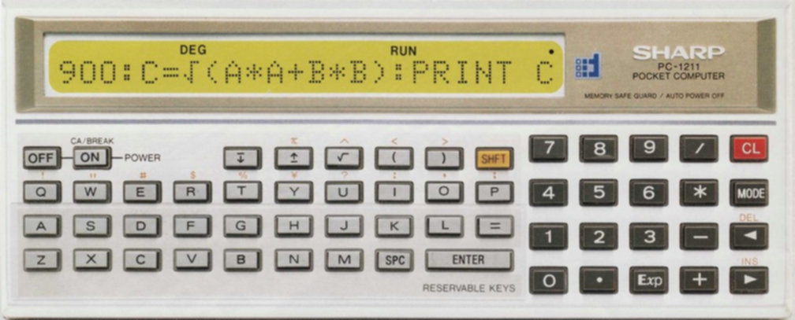
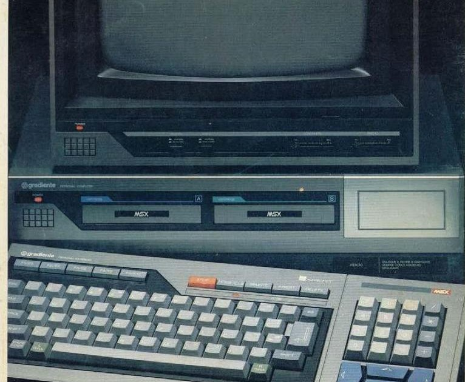

# MSX Disk Images

A repository of 8-bit programs on an MSX computer from the 1980s, when I was
between 10 and 14 years old.

My name is Plinio F Mendes (or pliniofm), I was born in Vitoria-ES-Brazil in
1976, but I grew up in Campinas-SP-Brazil. I learned programming Basic when
I was 9 years old in the Sharp PC-1211 calculator. The calculator was used by
my mom during their Engineering course.

And in few month I won my most amazing "toy", a MSX Computer, a Gradient
Expert. 

No disk drive, no K7, no modem or network, no way to store my programs or to
load a game. It was just me and the MSX Microsoft Basic to fend for myself.
Just some years later I won a K7 device and a 5" 1/4 disk drive.

The purpose of this repository is to bring together some of the programs I
created during that time. The problem is that many of them were experiments
and are not at all presentable or functional, but I will recover what I can.

## PLINIO04 Disk label 

This is the better disk image I have. The purpose of this disk was to present
in my school in 1990.

[[PLINIO04](plinio04/README.md)]

## Special thanks

My special thanks to [github.com/fgroen](https://github.com/fgroen) to allow
to recover all Basic source code. 

* [github.com/fgroen/msxconverter](https://github.com/fgroen/msxconverter)

## Contact

* [plinio.mendes[at]gmail.com](mailto:plinio.mendes[at]gmail.com)
