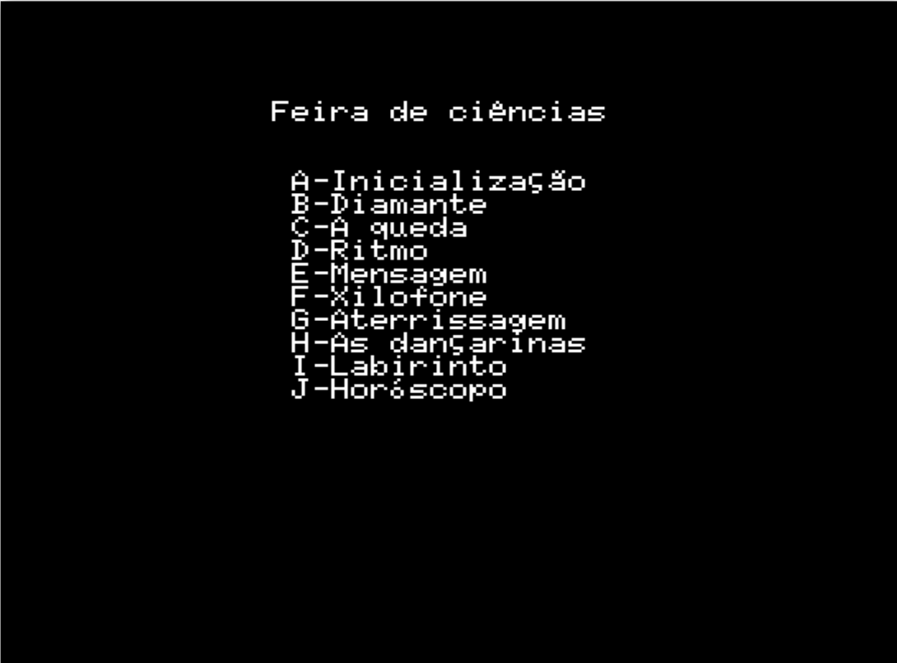
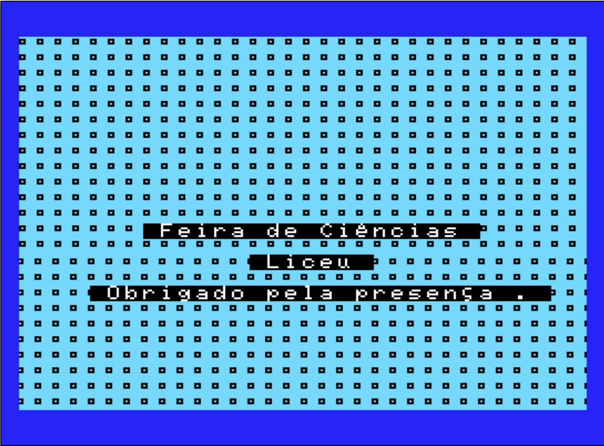
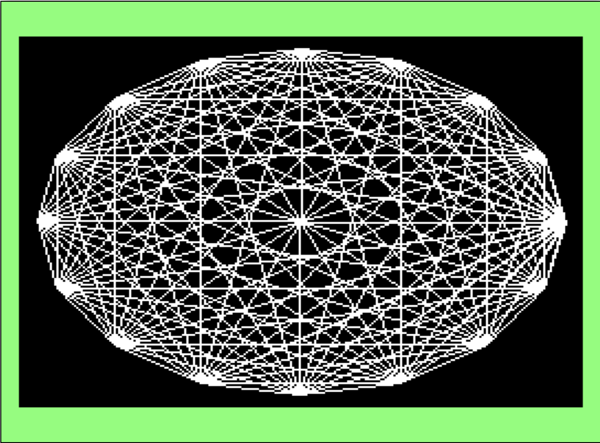
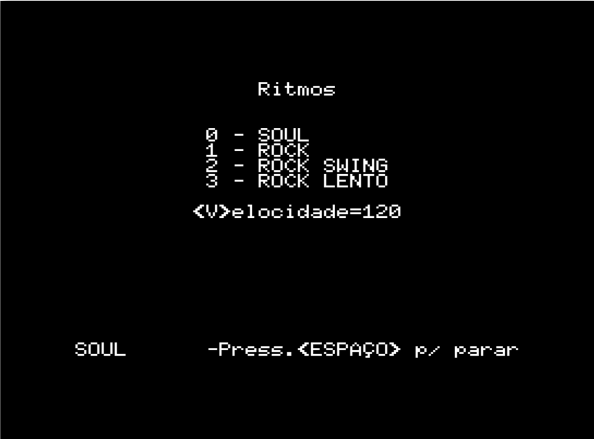
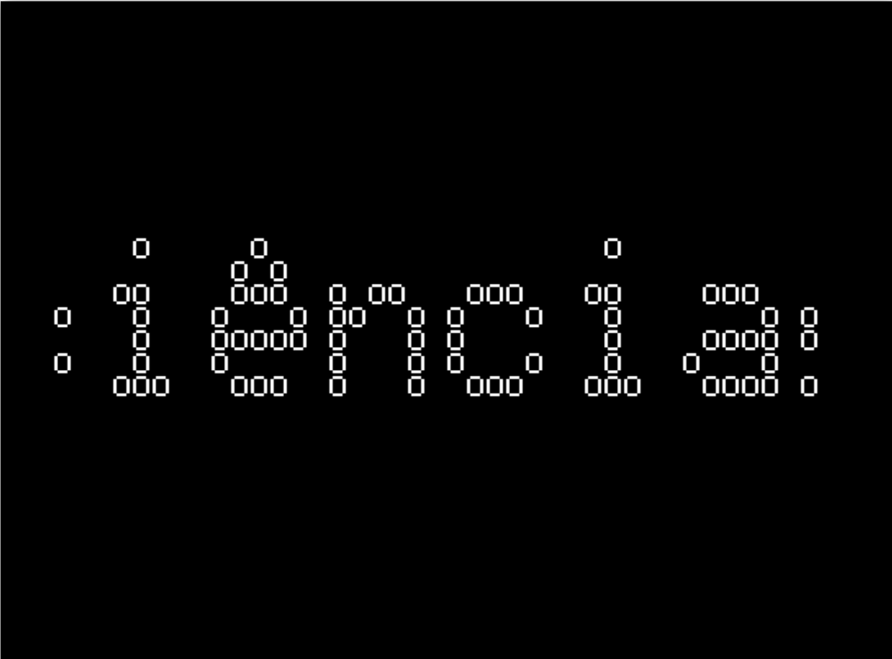
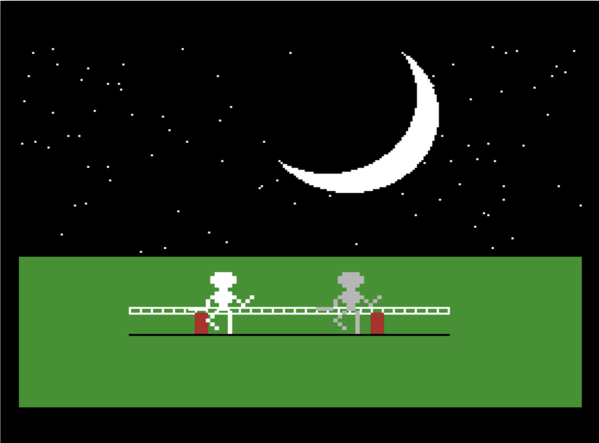
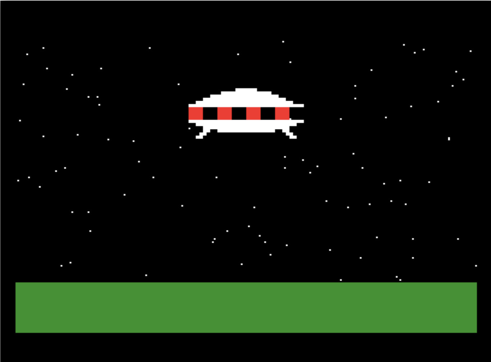
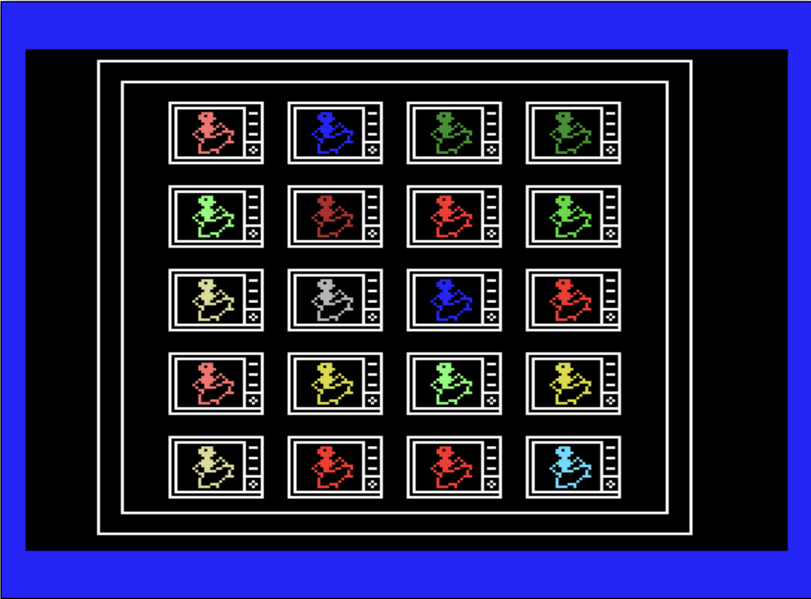
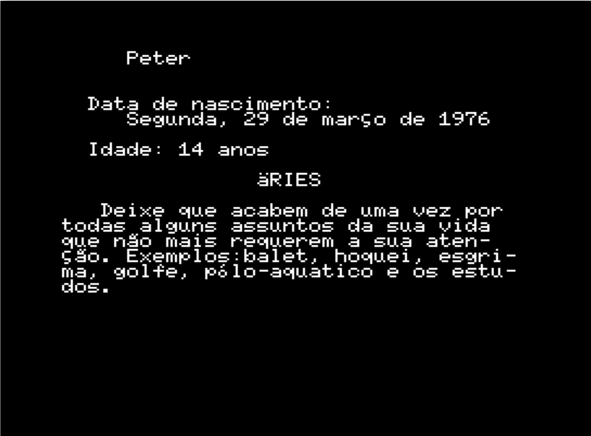
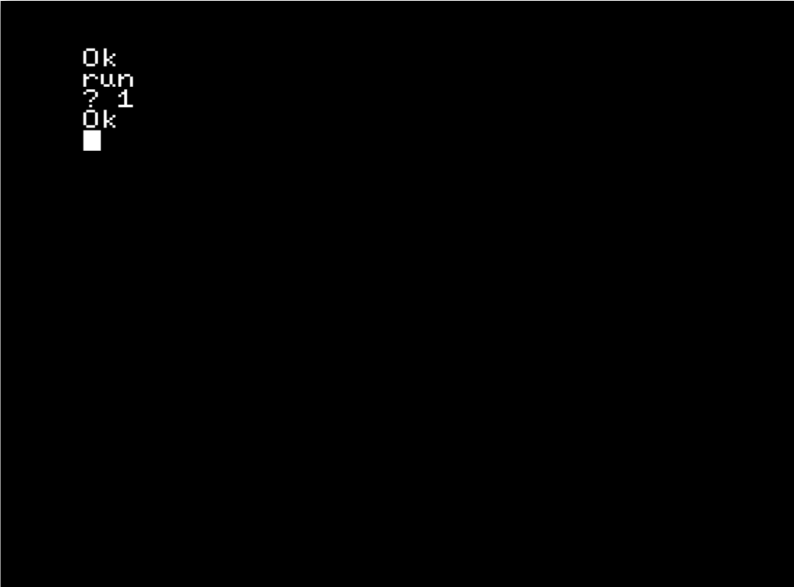

# PLINIO04 Disk image

Disk Image: [PLINIO04](PLINIO04.DSK)

The original language of filenames and texts is Portuguese. It was emulated in https://webmsx.org/.

## Programs

### Initial Menu

Files: [AUTOEXEC.BAS](files/AUTOEXEC.BAS), [MENU.BAS](files/MENU.BAS).

### Splash screen

Files: [ABERTURA.BAS](files/ABERTURA.BAS), [MOVECARA.BIN](files/MOVECARA.BIN)

## Diamond

File: [DIAMANTE.BAS](files/DIAMANTE.BAS)

## The fall

File: [QUEDA.BAS](files/QUEDA.BAS)

## Rhythm

File: [RITMO.BAS](files/RITMO.BAS)

## Marquee

File: [MENSAGEM.BAS](files/MENSAGEM.BAS)

## Xylophone

File: [XILOFONE.BAS](files/XILOFONE.BAS)

## Landing

File: [ATERRISS.BAS](files/ATERRISS.BAS)

## Dancers

File: [DANCA.BAS](files/DANCA.BAS)

## Maze

File: [LABIRINT.BAS](files/LABIRINT.BAS)

## Horoscope

File: [SIGNO.BAS](files/SIGNO.BAS)

## Music

File: [MUSIC.BAS](files/MUSIC.BAS)

No UI. Just choose a number between 1 to 12. 

## Periodic table

File: [TABEPERI.BAS](files/TABEPERI.BAS)

## Misc files

File:
* [JOGOVELH.BAS](files/JOGOVELH.BAS) - Hangman (incomplete)
* [PATO.BAS](files/PATO.BAS) - Duck (incomplete)
* [DIGIVOX.BIN](files/DIGIVOX.BIN) - I don't remember what it is :-(
* TABEPERI.BAS - It wasn't developed by me. :-(
